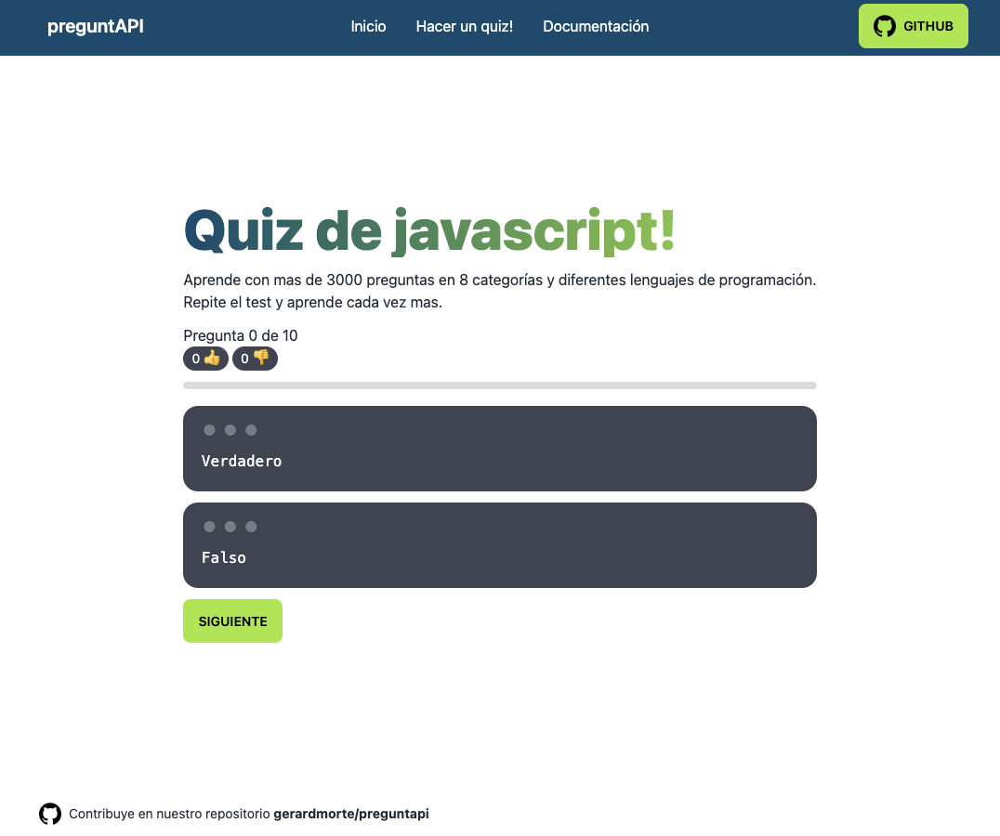

# [preguntAPI](https://www.preguntapi.dev)

## API gratuita y libre de preguntas de programación en español 🚀

<!-- add image here -->


## Instalación y funcionamiento en entorno de desarrollo

> nota: para entornos de producción deberá hacer el build de la aplicación web y el servidor correrlo con forever o pm2

***API***
```bash
cd preguntapi/server
npm install
npm run dev
```

***Aplicación web***
```bash
cd preguntapi
npm install
npm run dev
```

## Enlace de la aplicación web 🌱
**https://www.preguntapi.dev**

## Documentación 📋
**Puedes ver la documentación para el uso de la API [aquí](https://www.preguntapi.dev/documentation).**
